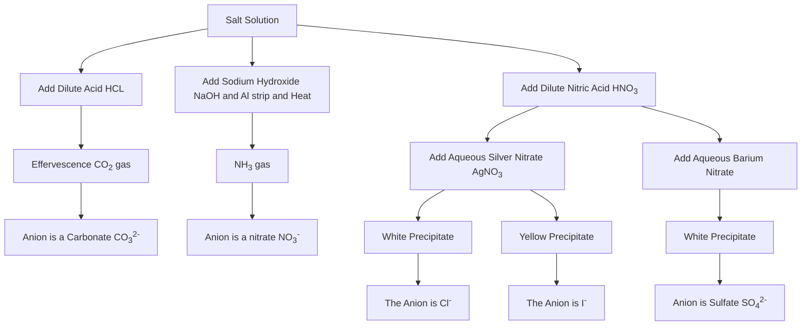

```mermaid
  flowchart TB;
      A[Salt Solution]-->B[Add Dilute Acid HCL]-->C[Effervescence CO<sub>2</sub> gas]-->D[Anion is a Carbonate CO<sub>3</sub><sup>2-</sup>]
      A-->E[Add Sodium Hydroxide NaOH and Al strip and Heat]-->F[NH<sub>3</sub> gas]-->G[Anion is a nitrate NO<sub>3</sub><sup>-</sup>]
      A[Salt Solution]-->H[Add Dilute Nitric Acid HNO<sub>3</sub>]
      H-->I[Add Aqueous Silver Nitrate AgNO<sub>3</sub>]
      H-->N[Add Aqueous Barium Nitrate]-->O[White Precipitate]-->P[Anion is Sulfate SO<sub>4</sub><sup>2-</sup>]
      I-->J[White Precipitate]-->K[The Anion is Cl<sup>-</sup>]
      I-->L[Yellow Precipitate]-->M[The Anion is I<sup>-</sup>]

      
```

#chemprac
#anion