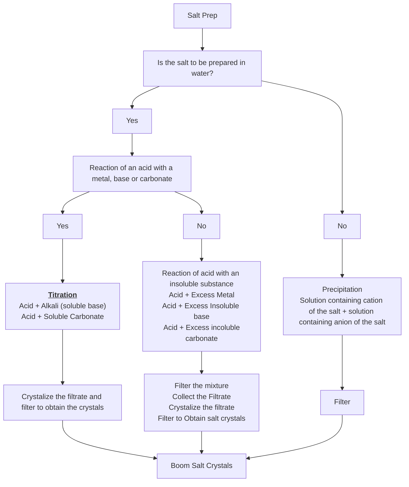

Before continuing with Salt Prep, it is advised to understand what makes a [[Salt]], [[Solubility Of Solids]] and [[Experimental Techniques]]

The reason why we add in excess is so that all the metal, base or carbonate is used up in the reaction